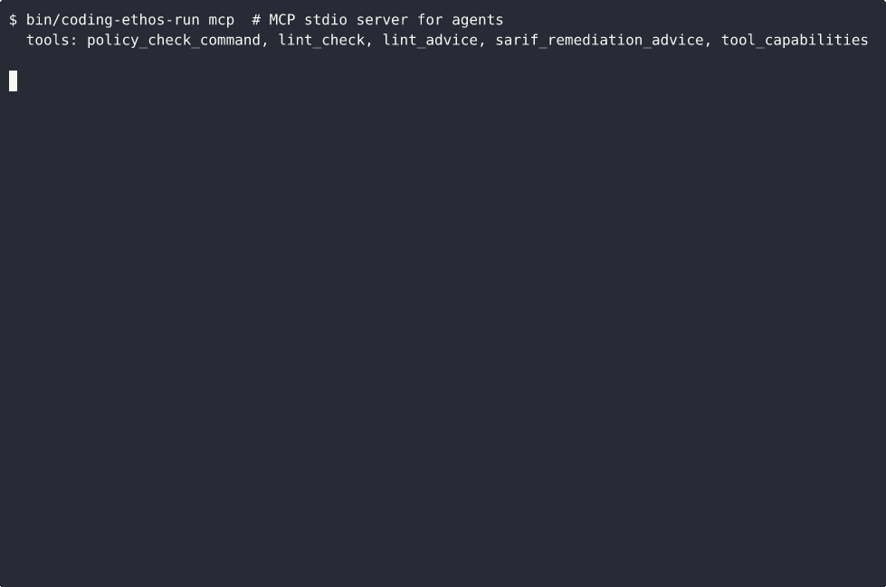

<!-- SPDX-FileCopyrightText: 2026 Blackcat Informatics Inc. <paudley@blackcat.ca> -->
<!-- SPDX-License-Identifier: MIT -->

# Coding Ethos Docs

`coding-ethos` is policy as code for AI coding agents. It turns a repository's
engineering principles into generated agent instructions, CEL policy checks,
Git hooks, MCP tools, SARIF output, runtime sandbox evidence, and CI gates.

## Start Here

- [README](../README.md): project overview, quick start, supported agents, and
  common workflows.
- [Repository analysis](REPOSITORY_ANALYSIS.md): source-of-truth boundaries,
  generated artifacts, and verification model.
- [Strategic roadmap](STRATEGIC_ROADMAP.md): major platform directions for MCP,
  CEL, SARIF, sandboxing, and agent remediation loops.
- [Trust signals](TRUST_SIGNALS.md): OpenSSF Scorecard, Best Practices badge,
  security posture, and publication checklist.
- [Threat model](THREAT_MODEL.md): protected assets, actors, trust
  boundaries, risks, and out-of-scope claims.
- [Release process](RELEASE.md): versioning, artifact, checklist, and release
  note expectations.
- [Discussions plan](DISCUSSIONS.md): recommended GitHub Discussions
  categories and issue/discussion boundaries.
- [Demo](DEMO.md): verified MCP, command-block, lint-check, and SARIF excerpts
  plus a recording plan.
- [Comparison](COMPARISON.md): how coding-ethos relates to pre-commit, CodeQL,
  Semgrep, OPA, branch protection, and plain agent instructions.
- [Integrations](INTEGRATIONS.md): Codex, Claude Code, Gemini CLI, MCP,
  GitHub Actions, GitLab CI, SARIF consumers, and managed static analysis.

## AI Agent Policy Enforcement

`coding-ethos` is built for agentic development workflows where Codex, Claude
Code, Gemini CLI, and human contributors need the same enforceable rules.

- [MCP server](MCP_SERVER.md): stdio MCP tools for policy checks, lint advice,
  SARIF remediation, risk summaries, and capability inspection.
- [Integrations](INTEGRATIONS.md): setup notes for Codex, Claude Code, Gemini
  CLI, MCP clients, GitHub Actions, GitLab CI, SARIF consumers, and managed
  tools.
- [Runtime sandboxing](RUNTIME_SANDBOXING.md): Bubblewrap, cgroups, seccomp,
  network isolation, and least-privilege tool capabilities.
- [Red-team suite](RED_TEAM_SUITE.md): adversarial coverage for hook bypass,
  shell parsing, protected paths, MCP framing, SARIF, and sandbox behavior.

## CEL Policy Language

CEL lets repos express narrow custom policies without adding a new Go evaluator
for every rule. Principle-owned CEL policies live with the ETHOS principle they
enforce.

- [Policy language strategy](POLICY_LANGUAGE_STRATEGY.md): CEL inputs, helper
  functions, staged migration path, and limits.
- [MCP server](MCP_SERVER.md): policy explanation and policy check tools that
  expose compiled CEL behavior to agents.

## SARIF And Code Scanning

SARIF turns local policy and static-analysis evidence into code-scanning,
artifact, trend, and remediation workflows.

- [CI/CD SARIF](CI_CD_SARIF.md): generated GitHub Actions and GitLab CI gates.
- [SARIF uses](SARIF_USES.md): remediation advice, risk summaries, trend
  analysis, editor loops, and policy feedback.
- [SARIF editor integration](SARIF_EDITOR_INTEGRATION.md): local workflows for
  developers and agents.

## Hook And Tool Runtime

- [Hook runtime bootstrap](HOOK_RUNTIME_BOOTSTRAP.md): checkout-local runtime
  artifacts, repair behavior, and consumer hook shims.
- [Lint capture Go flow](LINT_CAPTURE_GO_FLOW.md): managed lint capture through
  compiled Go request, target resolution, config validation, and normalized
  output.
- [Source docs index](SOURCE_DOCS.md): full document list for maintainers.
